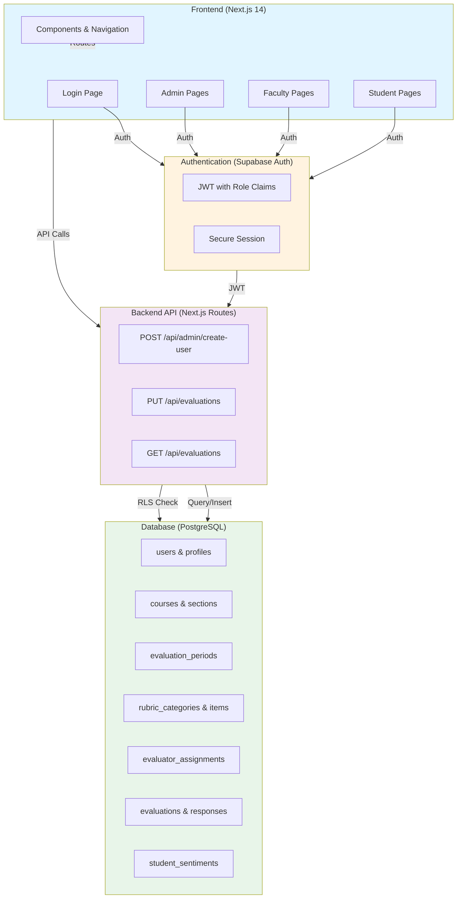
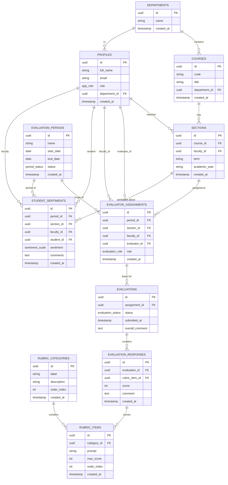
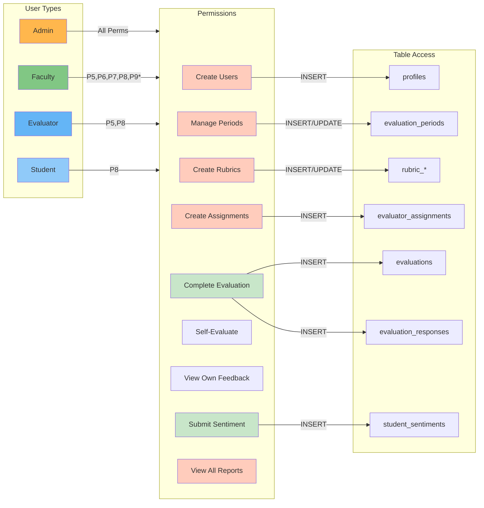
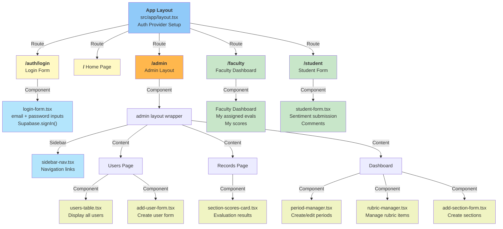

# Faculty Evaluation System - Visual Diagrams

## System Architecture Diagram



## User Flow Diagram - Complete Cycle

```mermaid
graph TD
    Start["🔵 System Start"] --> Admin["👤 ADMIN<br/>Setup & Management"]
    
    Admin --> P1["1️⃣ Create Evaluation Period<br/>Set dates, rubric version"]
    Admin --> P2["2️⃣ Create/Import Users<br/>Set roles"]
    Admin --> P3["3️⃣ Configure Rubric<br/>Categories &amp; Items"]
    Admin --> P4["4️⃣ Create Assignments<br/>Who evaluates whom"]
    
    P1 --> P4
    P2 --> P4
    P3 --> P4
    
    P4 --> Eval["👥 EVALUATORS<br/>Complete Assessments"]
    
    Eval --> E1["View Assignments<br/>for evaluation period"]
    E1 --> E2["Open Evaluation Form<br/>See assigned faculty"]
    E2 --> E3["Score Rubric Items<br/>1-5 scale + comments"]
    E3 --> E4["Submit Evaluation<br/>Stored in DB"]
    
    E4 --> Student["👥 STUDENTS<br/>Submit Sentiment"]
    
    Student --> S1["Access /student"]
    S1 --> S2["Select faculty member"]
    S2 --> S3["Submit sentiment<br/>Positive/Neutral/Negative"]
    S3 --> S4["Add optional comments"]
    S4 --> S5["Stored in DB"]
    
    E4 --> Faculty["👤 FACULTY<br/>View Results"]
    S5 --> Faculty
    
    Faculty --> F1["Login to /faculty"]
    F1 --> F2["View peer feedback<br/>Aggregated scores"]
    F2 --> F3["Review student sentiment<br/>Qualitative feedback"]
    F3 --> F4["Download report<br/>PDF/CSV"]
    
    F4 --> Report["📊 Admin Reporting<br/>Analytics &amp; Export"]
    
    Report --> R1["View completion rates"]
    Report --> R2["Aggregate scores by category"]
    Report --> R3["Export for external analysis"]
    
    R1 --> End["✅ Cycle Complete"]
    R2 --> End
    R3 --> End

    style Start fill:#90caf9
    style Admin fill:#ffb74d
    style Eval fill:#81c784
    style Student fill:#81c784
    style Faculty fill:#64b5f6
    style Report fill:#ba68c8
    style End fill:#90caf9
```



## Authentication & Authorization Flow

```mermaid
sequenceDiagram
    participant User
    participant Login as Login Form
    participant Auth as Supabase Auth
    participant JWT as JWT Token
    participant API as Next.js API
    participant RLS as RLS Policies
    participant DB as PostgreSQL

    User->>Login: Enter credentials
    Login->>Auth: POST /auth/sign-in
    Auth->>JWT: Generate JWT with role
    JWT->>Login: Return token + session
    
    Login->>User: Redirect to dashboard
    
    User->>API: Make API request + JWT
    API->>JWT: Validate signature
    JWT->>API: Extract claims &amp; role
    
    API->>DB: Query (with auth context)
    DB->>RLS: Check policies
    RLS->>RLS: Evaluate role &amp; ownership
    
    alt Policy Allows
        RLS->>DB: ✓ Execute query
        DB->>API: Return data
        API->>User: 200 OK + data
    else Policy Denies
        RLS->>DB: ✗ Deny access
        DB->>API: No rows returned
        API->>User: 403 Forbidden
    end
```

## Evaluation Submission Flow

```mermaid
graph LR
    E["Evaluator"] -->|Login| Dashboard["Dashboard:<br/>My Assignments"]
    
    Dashboard -->|Select| Form["Evaluation Form<br/>(rubric_items)"]
    
    Form -->|Score each item| Items["Rubric Items<br/>Category 1: Commitment<br/>Category 2: Knowledge<br/>Category 3: Independent Learning<br/>Category 4: Learning Mgmt"]
    
    Items -->|Complete all| Submit["🔘 Submit<br/>evaluation"]
    
    Submit -->|POST| API["API Route<br/>/api/evaluations"]
    
    API -->|Create| EvalRecord["evaluations<br/>assignment_id, status"]
    API -->|Bulk Insert| Responses["evaluation_responses<br/>rubric_item_id, score, comment"]
    
    EvalRecord -->|Link to| Assignment["evaluator_assignments<br/>(already exists)"]
    
    Responses -->|Reference| Items
    
    Assignment -->|Admin can query| AdminDash["Admin Dashboard<br/>View Scores<br/>Aggregate by Category<br/>Identify Trends"]
    
    style Form fill:#fff9c4
    style Items fill:#fff9c4
    style Submit fill:#ffb74d
    style API fill:#b39ddb
    style EvalRecord fill:#c8e6c9
    style Responses fill:#c8e6c9
    style AdminDash fill:#ffccbc
```



## Database Relationships - Entity Diagram



## Admin Dashboard Workflow

```mermaid
graph TB
    Admin["👤 Admin User"]
    
    Admin -->|Access| Dashboard["/admin Dashboard"]
    
    Dashboard -->|Manage| Users["👥 Users<br/>components/admin/users-table.tsx<br/>components/admin/add-user-form.tsx"]
    Dashboard -->|Configure| Periods["⏱️ Periods<br/>components/admin/period-manager.tsx"]
    Dashboard -->|Design| Rubrics["📋 Rubrics<br/>components/admin/rubric-manager.tsx"]
    Dashboard -->|Setup| Sections["📚 Sections<br/>components/admin/add-section-form.tsx"]
    Dashboard -->|Assign| Evals["🎯 Evaluator<br/>Assignments"]
    Dashboard -->|Monitor| Monitor["📊 Monitoring<br/>components/admin/section-scores-card.tsx"]
    
    Users -->|Create/Edit| UserDB["profiles table<br/>role assignment"]
    Periods -->|Create/Edit| PeriodDB["evaluation_periods table<br/>rubric_version, status"]
    Rubrics -->|Create/Edit| RubricDB["rubric_categories<br/>rubric_items tables"]
    Sections -->|Create/Edit| SectionDB["sections table<br/>course_id, faculty_id"]
    
    Evals -->|Link| AssignDB["evaluator_assignments<br/>period_id, faculty_id,<br/>evaluator_id, role"]
    
    Monitor -->|Query| EvalDB["evaluations &<br/>evaluation_responses tables"]
    EvalDB -->|Aggregate| Report["Scores by category<br/>Completion rates<br/>Trends"]
    
    Report -->|Export| Export["📁 CSV/PDF<br/>Reports"]
    
    style Admin fill:#64b5f6
    style Dashboard fill:#fff9c4
    style Users fill:#b39ddb
    style Periods fill:#b39ddb
    style Rubrics fill:#b39ddb
    style Sections fill:#b39ddb
    style Evals fill:#b39ddb
    style Monitor fill:#ffb74d
    style Export fill:#81c784
```



## Email & Permission Matrix



## Data Aggregation for Reporting

```mermaid
graph TB
    EvalResp["evaluation_responses<br/>(all submitted scores)"]
    
    EvalResp -->|GROUP BY rubric_item_id| ByItem["Scores per<br/>Rubric Item"]
    
    ByItem -->|JOIN rubric_items<br/>THEN GROUP BY category_id| ByCategory["Scores per<br/>Category"]
    
    ByCategory -->|AGGREGATE by faculty_id<br/>period_id| Summary["Faculty Summary<br/>per Period"]
    
    ByItem -->|AGGREGATE by period_id| Trend["Trend Analysis<br/>Across Periods"]
    
    Summary -->|Calculate| Stats["Mean, Median, StdDev<br/>per Category"]
    Trend -->|Calculate| TrendStats["Change Over Time<br/>per Faculty"]
    
    Stats -->|Export| CSV["CSV Report"]
    Stats -->|Format| PDF["PDF Report"]
    TrendStats -->|Chart| Chart["📈 Trend Charts"]
    
    CSV -->|Admin| Admin["Download &amp;<br/>Share"]
    PDF -->|Faculty| Faculty["Personal<br/>Reports"]
    Chart -->|Admin| AdminDash["Dashboard<br/>Insights"]

    style EvalResp fill:#c8e6c9
    style ByItem fill:#b3e5fc
    style ByCategory fill:#b3e5fc
    style Summary fill:#fff9c4
    style Trend fill:#fff9c4
    style Stats fill:#ffe0b2
    style TrendStats fill:#ffe0b2
    style CSV fill:#ffccbc
    style PDF fill:#ffccbc
    style Chart fill:#f0f4c3
    style Admin fill:#81c784
    style Faculty fill:#81c784
    style AdminDash fill:#81c784
```



## Request Lifecycle with RLS

```mermaid
sequenceDiagram
    participant Client
    participant Server as Next.js Server
    participant Auth as Supabase Auth
    participant DB as PostgreSQL + RLS

    Client->>Server: GET /api/evaluations<br/>(with JWT)
    
    Server->>Auth: Validate JWT signature
    Auth->>Server: ✓ Valid<br/>Extract user_id &amp; role
    
    Server->>DB: SELECT * FROM evaluations<br/>WHERE evaluator_id = $1<br/>(user_id in context)
    
    Note over DB: RLS Policy Check:<br/>select_evaluations
    
    DB->>DB: Check policy condition:<br/>auth.uid() = evaluator_id<br/>OR app_is_admin()
    
    alt User is Evaluator
        DB->>DB: ✓ Policy passes<br/>Execute query
        DB->>Server: Return user's evaluations
    else User is not Evaluator
        DB->>DB: ✗ Policy fails<br/>Return 0 rows
        DB->>Server: Empty result set
    end
    
    alt Has admin role
        DB->>DB: app_is_admin() = true<br/>Return all evaluations
        DB->>Server: Return all evaluations
    end
    
    Server->>Client: 200 OK + filtered data
```

## Component Tree with Rendering



## Integration Points

```mermaid
graph TB
    subgraph External["External Systems"]
        Email["📧 Email Service<br/>(Future)"]
        Calendar["📅 Calendar<br/>(Future)"]
        Export["📁 Export Tools<br/>(PDF, CSV)"]
    end
    
    subgraph Core["Faculty Evaluation Core"]
        Auth["🔐 Supabase Auth"]
        API["🔌 Next.js API Routes"]
        DB["🗄️ PostgreSQL"]
        UI["🎨 React Components"]
    end
    
    subgraph Analytics["Analytics & Reporting"]
        Dashboard["📊 Admin Dashboard"]
        Reports["📋 Reports Generator"]
        Trends["📈 Trend Analysis"]
    end
    
    Email -->|Notify Evaluators| Auth
    Calendar -->|Sync Deadlines| API
    Export -->|Generate from DB| Reports
    Reports -->|Feed to| Dashboard
    Trends -->|Display in| Analytics
    
    Auth -->|Secure Access| API
    API -->|Query &amp; Mutate| DB
    API -->|Power| UI
    UI -->|Send Input| API
    
    DB -->|Source Data| Analytics
    
    Dashboard -->|View Trends| Trends
    Reports -->|Include Charts| Trends
    
    style External fill:#e0e0e0
    style Core fill:#fff3e0
    style Analytics fill:#f3e5f5
    style Auth fill:#ffb74d
    style API fill:#81c784
    style DB fill:#64b5f6
```



---

## Usage Instructions for Diagrams

These diagrams can be:
1. **Embedded in documentation** - Include as markdown code blocks
2. **Rendered online** - Use [mermaid.live](https://mermaid.live/)
3. **Integrated in VS Code** - Install "Markdown Preview Mermaid Support" extension
4. **Exported** - Click "Download" in mermaid.live to get PNG/SVG

---

**Generated**: February 2026  
**System**: Faculty Evaluation 0.1.0
